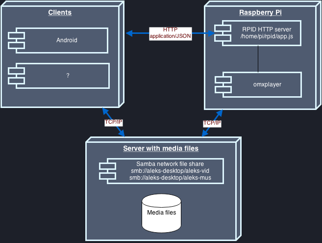

##Introduction
The RPID project goal is to create a *Chromecast*-like system to remotely play multimedia files shared on a local network.

##Dependencies
RPID is built with Node.js. To start developing, you will need to install:

1. Node.js `apt-get install nodejs`
2. grunt `apt-get install grunt`
3. nodemon `npm install -g nodemon`

##Installation
All Node.js dependencies are under source control in the folder *node_modules*. If you want to install
dependencies directly from an npm server, run this command:

`npm install`

##Usage
1. Start RPID server on [http://localhost:3000/](http://localhost:3000/)
`grunt run`

2. Run jslint and unit tests `grunt test --force`

##Architecture

##API
By importing [./doc/api_postman.json](./doc/api_postman.json) into the  [Postman rest client tool](https://chrome.google.com/webstore/detail/postman-rest-client/fdmmgilgnpjigdojojpjoooidkmcomcm?hl=en), you will be able to see a description of the API as well as launch pre-defined queries against any RPID server.
